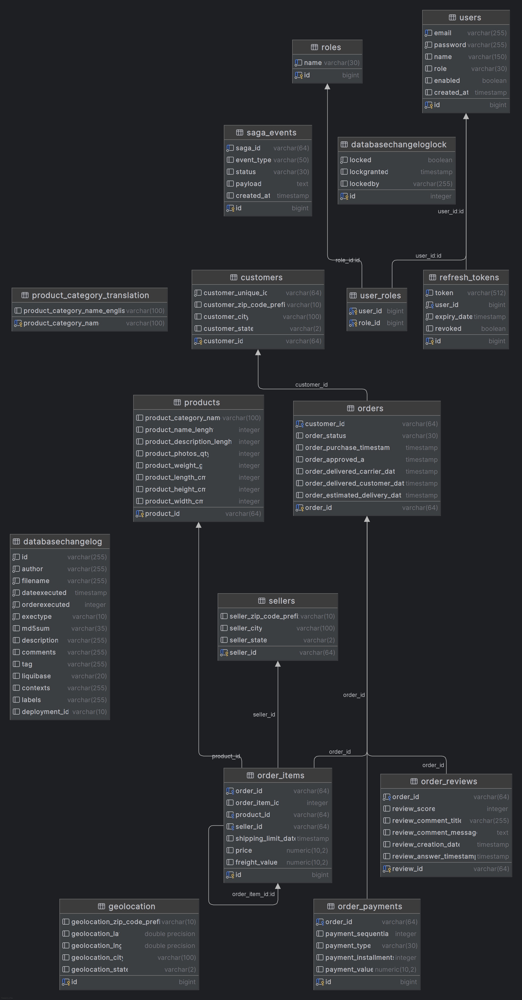

# 🚀 SAGA - Spring Boot Microservice

API RESTful de e-commerce com padrão **SAGA Orchestration** para gerenciamento de pedidos, construída com **Spring Boot 4.1.0** e **Java 25**.

---

## 📋 Índice

- [Arquitetura](#-arquitetura)
- [Tecnologias](#-tecnologias)
- [Estrutura do Projeto](#-estrutura-do-projeto)
- [Padrão SAGA](#-padrão-saga)
- [Autenticação & Autorização](#-autenticação--autorização)
- [Endpoints da API](#-endpoints-da-api)
- [Configuração & Execução](#-configuração--execução)
- [Variáveis de Ambiente (.env)](#-variáveis-de-ambiente-env)
- [Banco de Dados & Liquibase](#-banco-de-dados--liquibase)
- [Vault](#-vault)
- [Rate Limiting](#-rate-limiting)
- [Swagger](#-swagger)

---

## 🏗 Arquitetura

O projeto segue uma arquitetura em camadas com separação clara de responsabilidades:

```
┌─────────────────────────────────────────────────────────────────┐
│                        CONTROLLER LAYER                          │
│   AuthController · CustomerController · OrderController          │
│   ProductController · UserController                             │
├─────────────────────────────────────────────────────────────────┤
│                         SERVICE LAYER                            │
│   AuthService · CustomerService · OrderService                   │
│   ProductService · UserService · UserDetailsServiceImpl          │
├─────────────────────────────────────────────────────────────────┤
│                      SAGA ORCHESTRATION                          │
│   SagaOrchestrator · SagaEventListener                          │
│          ↕ Kafka (order-created / payment-processed /            │
│                    order-compensate)                              │
├─────────────────────────────────────────────────────────────────┤
│                       REPOSITORY LAYER                           │
│   JPA Repositories (Spring Data)                                 │
├─────────────────────────────────────────────────────────────────┤
│                        INFRASTRUCTURE                            │
│   PostgreSQL · Kafka · Vault · Liquibase                         │
└─────────────────────────────────────────────────────────────────┘
```

### Fluxo de uma requisição

```
Client → JWT Filter → Rate Limit Interceptor → Controller → Service → Repository → DB
                                                    ↓
                                              SAGA Orchestrator → Kafka Events
```

---

## 🛠 Tecnologias

| Tecnologia | Versão | Finalidade |
|---|---|---|
| **Java** | 25 | Linguagem principal |
| **Spring Boot** | 4.1.0 | Framework base |
| **Spring Security** | 7.x | Autenticação e autorização |
| **Spring Data JPA** | 4.x | Acesso a dados |
| **Spring HATEOAS** | 3.x | Maturidade REST (Level 3) |
| **Spring Cloud Vault** | 2025.1.2 | Gerenciamento de secrets |
| **Spring Kafka** | 4.x | Mensageria para SAGA |
| **Liquibase** | - | Versionamento de schema |
| **PostgreSQL** | latest | Banco de dados relacional |
| **Jackson 3.x** | 3.1.4 | Serialização JSON |
| **JJWT** | 0.12.6 | Geração/validação de tokens JWT |
| **SpringDoc OpenAPI** | 3.0.3 | Documentação Swagger |
| **MapStruct** | 1.5.5 | Mapeamento DTO ↔ Entity |
| **Bucket4j** | 8.10.1 | Rate limiting |

| **Lombok** | - | Redução de boilerplate |
| **H2** | - | Banco in-memory para testes |
| **Gradle** | 9.5.1 | Build tool |
| **Docker Compose** | 3.8 | Orquestração de containers |

---

## 📂 Estrutura do Projeto

```
saga/
├── .env                        # Variáveis de ambiente (NÃO comitar)
├── .env.example                # Template de variáveis (comitar)
├── docker-compose.yml          # Infraestrutura (PostgreSQL, Kafka, Vault)
├── build.gradle                # Dependências e plugins
├── settings.gradle             # Configuração do Gradle + toolchain JDK 25
│
├── data/                       # Datasets CSV (Olist) carregados via Liquibase
│   ├── olist_customers_dataset.csv
│   ├── olist_orders_dataset.csv
│   ├── olist_order_items_dataset.csv
│   ├── olist_order_payments_dataset.csv
│   ├── olist_order_reviews_dataset.csv
│   ├── olist_products_dataset.csv
│   ├── olist_sellers_dataset.csv
│   ├── olist_geolocation_dataset.csv
│   └── product_category_name_translation.csv
│
└── src/main/java/br/com/saga/
    ├── config/                 # Configurações (Security, Kafka, Swagger, Rate Limit, Jackson)
    ├── controller/             # REST Controllers com validação e HATEOAS
    ├── domain/
    │   ├── entity/             # Entidades JPA
    │   └── enums/              # Enumerações (SagaStatus)
    ├── dto/
    │   ├── request/            # Payloads de entrada com Bean Validation
    │   └── response/           # Payloads de saída com HATEOAS links
    ├── exception/              # Global Exception Handler + exceções customizadas
    ├── mapper/                 # MapStruct mappers (Entity → Response)
    ├── repository/             # Spring Data JPA Repositories
    ├── saga/                   # SAGA Orchestrator + Event Listeners (Kafka)
    ├── security/               # JWT Service + Authentication Filter
    ├── service/                # Lógica de negócio
    └── SagaApplication.java    # Entry point

src/main/resources/
├── db/changelog/               # Liquibase changelogs (YAML)
│   ├── db.changelog-master.yml
│   ├── 001-create-tables.yml
│   ├── 002-create-auth-tables.yml
│   ├── 003-load-data.yml
│   └── 004-create-roles-tables.yml
└── application.yml             # Configuração principal (referencia variáveis do .env)
```

---

## 🔄 Padrão SAGA

O projeto implementa o padrão **SAGA Orchestration** para gerenciar transações distribuídas na criação de pedidos.

### Fluxo de Criação de Pedido

```
┌──────────────┐     ┌─────────────────┐     ┌──────────────────┐
│   API POST   │────▶│ SagaOrchestrator│────▶│  Validar:        │
│  /orders     │     │                 │     │  • Customer      │
└──────────────┘     │                 │     │  • Seller(s)     │
                     │                 │     │  • Product(s)    │
                     │                 │     └──────────────────┘
                     │                 │              │
                     │                 │              ▼
                     │                 │     ┌──────────────────┐
                     │                 │────▶│  Salvar Order    │
                     │                 │     │  + Items         │
                     │                 │     │  + Payment       │
                     │                 │     └──────────────────┘
                     │                 │              │
                     │                 │              ▼
                     │                 │     ┌──────────────────┐
                     │                 │────▶│  Kafka Event     │
                     │                 │     │ order-created    │
                     └─────────────────┘     └──────────────────┘
```

**Validações pré-SAGA (antes de iniciar a transação):**
- Customer existe no banco?
- Seller existe para cada item do pedido?
- Product existe para cada item do pedido?

Se qualquer validação falhar, retorna `404` sem iniciar a SAGA.

### Compensação (Rollback)

```
Falha detectada → SagaOrchestrator publica em "order-compensate"
                        ↓
              SagaEventListener consome o evento
                        ↓
              Executa compensação (rollback)
```

### Tópicos Kafka

| Tópico | Descrição |
|---|---|
| `order-created` | Emitido quando um pedido é criado com sucesso |
| `seller-notified` | Emitido para cada seller envolvido no pedido (notificação de venda) |
| `payment-processed` | Consumido para aprovar o pedido |
| `order-compensate` | Emitido em caso de falha para compensação |

### Configuração do Kafka

O `KafkaTemplate` é configurado **explicitamente** via `KafkaConfig` com `ProducerFactory` manual.
Isso garante que a aplicação inicializa mesmo sem o broker Kafka disponível (os eventos ficam pendentes até a conexão ser estabelecida).

Em ambiente de **teste**, o `KafkaTemplate` é substituído por um mock via `@MockitoBean`, eliminando a dependência do broker.

### Kafka UI

A interface web para gerenciar o Kafka está disponível em:

- **URL**: [http://localhost:8090](http://localhost:8090)

Permite visualizar:
- Tópicos e suas partições
- Mensagens produzidas/consumidas
- Consumer groups e lag
- Configurações do cluster

### Rastreamento

Todos os eventos da SAGA são persistidos na tabela `saga_events` com:
- `saga_id` — identificador único da transação
- `event_type` — tipo do evento (ORDER_CREATION, COMPENSATION)
- `status` — STARTED, PROCESSING, COMPLETED, COMPENSATING, FAILED
- `payload` — dados serializados do evento

---

## 🔐 Autenticação & Autorização

### JWT (JSON Web Token)

O sistema utiliza autenticação stateless baseada em tokens JWT:

- **Access Token** — válido por 15 minutos (configurável via `JWT_ACCESS_TOKEN_EXPIRATION`)
- **Refresh Token** — válido por 24 horas (configurável via `JWT_REFRESH_TOKEN_EXPIRATION`), armazenado no banco

### Fluxo de Autenticação

```
1. POST /api/v1/auth/register   → Cria usuário + retorna tokens
2. POST /api/v1/auth/login      → Autentica + retorna tokens
3. POST /api/v1/auth/refresh    → Renova access token via refresh token
4. Header: Authorization: Bearer <access_token>
```

### RBAC (Role-Based Access Control)

| Role | Permissões |
|---|---|
| `ROLE_USER` | Acesso a endpoints de leitura (customers, orders, products) |
| `ROLE_ADMIN` | Tudo de ROLE_USER + gerenciamento de usuários (CRUD) |

A associação de roles é feita via tabela `user_roles` (Many-to-Many).

### Segurança

- Senhas armazenadas com **BCrypt**
- Refresh tokens com **revogação** e **expiração**
- Endpoints públicos: `/api/v1/auth/**`, `/swagger-ui/**`, `/v3/api-docs/**`, `/actuator/health`
- Credenciais externalizadas via **`.env`** (nunca hardcoded)

---

## 📡 Endpoints da API

### Autenticação (`/api/v1/auth`) — 🔓 Público

| Método | Path | Descrição | Código |
|---|---|---|---|
| POST | `/register` | Registrar novo usuário | 201 / 422 |
| POST | `/login` | Autenticar usuário | 200 / 401 |
| POST | `/refresh` | Renovar access token | 200 / 422 |

#### Register

```json
POST /api/v1/auth/register
{
  "name": "João Silva",
  "email": "joao@email.com",
  "password": "senha123"
}

// Response 201
{
  "accessToken": "eyJhbGciOiJIUzI1NiJ9...",
  "refreshToken": "550e8400-e29b-41d4-a716-446655440000",
  "tokenType": "Bearer",
  "expiresIn": 900000
}
```

#### Login

```json
POST /api/v1/auth/login
{
  "email": "joao@email.com",
  "password": "senha123"
}

// Response 200
{
  "accessToken": "eyJhbGciOiJIUzI1NiJ9...",
  "refreshToken": "a1b2c3d4-e5f6-7890-abcd-ef1234567890",
  "tokenType": "Bearer",
  "expiresIn": 900000
}
```

#### Refresh Token

```json
POST /api/v1/auth/refresh
{
  "refreshToken": "550e8400-e29b-41d4-a716-446655440000"
}

// Response 200 — novo par de tokens (refresh anterior é revogado)
{
  "accessToken": "eyJhbGciOiJIUzI1NiJ9...",
  "refreshToken": "new-uuid-token",
  "tokenType": "Bearer",
  "expiresIn": 900000
}
```

---

### Usuários (`/api/v1/users`) — 🔒 ROLE_ADMIN

| Método | Path | Descrição | Código |
|---|---|---|---|
| GET | `/` | Listar usuários paginados | 200 / 403 |
| GET | `/{id}` | Buscar usuário por ID | 200 / 404 / 403 |
| PUT | `/{id}` | Atualizar usuário/roles | 200 / 404 / 403 |
| DELETE | `/{id}` | Remover usuário | 204 / 404 / 403 |

#### Listar Usuários

```json
GET /api/v1/users?page=0&size=10

// Response 200
{
  "content": [
    {
      "id": 1,
      "name": "João Silva",
      "email": "joao@email.com",
      "enabled": true,
      "createdAt": "2024-01-01T10:00:00",
      "roles": ["ROLE_USER"],
      "_links": {
        "self": { "href": "http://localhost:8080/api/v1/users/1" },
        "users": { "href": "http://localhost:8080/api/v1/users" }
      }
    }
  ],
  "totalElements": 1,
  "totalPages": 1
}
```

#### Atualizar Usuário

```json
PUT /api/v1/users/1
{
  "name": "João Atualizado",
  "password": "novaSenha123",
  "roles": ["ROLE_USER", "ROLE_ADMIN"],
  "enabled": true
}

// Response 200
{
  "id": 1,
  "name": "João Atualizado",
  "email": "joao@email.com",
  "enabled": true,
  "createdAt": "2024-01-01T10:00:00",
  "roles": ["ROLE_USER", "ROLE_ADMIN"],
  "_links": { ... }
}
```

#### Remover Usuário

```
DELETE /api/v1/users/1

// Response 204 No Content
```

---

### Customers (`/api/v1/customers`) — 🔒 Autenticado

| Método | Path | Descrição | Código |
|---|---|---|---|
| GET | `/` | Listar clientes paginados | 200 |
| GET | `/{id}` | Buscar cliente por ID | 200 / 404 |
| POST | `/` | Criar novo cliente | 201 / 422 |
| PUT | `/{id}` | Atualizar cliente | 200 / 404 |
| DELETE | `/{id}` | Remover cliente | 204 / 404 |

#### Buscar Cliente

```json
GET /api/v1/customers/06b8999e2fba1a1fbc88172c00ba8bc7

// Response 200
{
  "customerId": "06b8999e2fba1a1fbc88172c00ba8bc7",
  "customerUniqueId": "861eff4711a542e4b93843c6dd7febb0",
  "customerZipCodePrefix": "14409",
  "customerCity": "franca",
  "customerState": "SP",
  "_links": {
    "self": { "href": "http://localhost:8080/api/v1/customers/06b8999e..." },
    "customers": { "href": "http://localhost:8080/api/v1/customers" }
  }
}
```

#### Criar Cliente

```json
POST /api/v1/customers
{
  "customerId": "abc123def456",
  "customerUniqueId": "unique789",
  "customerZipCodePrefix": "01001",
  "customerCity": "São Paulo",
  "customerState": "SP"
}

// Response 201
{
  "customerId": "abc123def456",
  "customerUniqueId": "unique789",
  "customerZipCodePrefix": "01001",
  "customerCity": "São Paulo",
  "customerState": "SP",
  "_links": { ... }
}
```

#### Atualizar Cliente

```json
PUT /api/v1/customers/abc123def456
{
  "customerId": "abc123def456",
  "customerUniqueId": "unique789",
  "customerZipCodePrefix": "02002",
  "customerCity": "Campinas",
  "customerState": "SP"
}

// Response 200
```

#### Remover Cliente

```
DELETE /api/v1/customers/abc123def456

// Response 204 No Content
```

---

### Products (`/api/v1/products`) — 🔒 Autenticado

| Método | Path | Descrição | Código |
|---|---|---|---|
| GET | `/` | Listar produtos paginados | 200 |
| GET | `/{id}` | Buscar produto por ID | 200 / 404 |
| POST | `/` | Criar novo produto | 201 / 422 |
| PUT | `/{id}` | Atualizar produto | 200 / 404 |
| DELETE | `/{id}` | Remover produto | 204 / 404 |

#### Buscar Produto

```json
GET /api/v1/products/1e9e8ef04dbcff4541ed26657ea517e5

// Response 200
{
  "productId": "1e9e8ef04dbcff4541ed26657ea517e5",
  "productCategoryName": "perfumaria",
  "productNameLength": 40,
  "productDescriptionLength": 287,
  "productPhotosQty": 1,
  "productWeightG": 225,
  "productLengthCm": 16,
  "productHeightCm": 10,
  "productWidthCm": 14,
  "_links": {
    "self": { "href": "http://localhost:8080/api/v1/products/1e9e8ef0..." },
    "products": { "href": "http://localhost:8080/api/v1/products" }
  }
}
```

#### Criar Produto

```json
POST /api/v1/products
{
  "productId": "new-product-id-123",
  "productCategoryName": "eletronicos",
  "productNameLength": 35,
  "productDescriptionLength": 500,
  "productPhotosQty": 3,
  "productWeightG": 1200,
  "productLengthCm": 30,
  "productHeightCm": 20,
  "productWidthCm": 15
}

// Response 201
```

#### Atualizar Produto

```json
PUT /api/v1/products/new-product-id-123
{
  "productId": "new-product-id-123",
  "productCategoryName": "informatica",
  "productNameLength": 40,
  "productDescriptionLength": 600,
  "productPhotosQty": 5,
  "productWeightG": 1500,
  "productLengthCm": 35,
  "productHeightCm": 25,
  "productWidthCm": 20
}

// Response 200
```

#### Remover Produto

```
DELETE /api/v1/products/new-product-id-123

// Response 204 No Content
```

---

### Orders (`/api/v1/orders`) — 🔒 Autenticado

| Método | Path | Descrição | Código |
|---|---|---|---|
| GET | `/` | Listar pedidos paginados | 200 |
| GET | `/{id}` | Buscar pedido com itens e pagamentos | 200 / 404 |
| GET | `/customer/{customerId}` | Pedidos por cliente | 200 |
| POST | `/` | Criar pedido via SAGA | 201 / 404 / 422 |
| PATCH | `/{id}/status` | Atualizar status do pedido | 200 / 404 |
| DELETE | `/{id}` | Remover pedido (+ itens + pagamentos) | 204 / 404 |

#### Criar Pedido (SAGA)

```json
POST /api/v1/orders
{
  "customerId": "06b8999e2fba1a1fbc88172c00ba8bc7",
  "items": [
    {
      "productId": "1e9e8ef04dbcff4541ed26657ea517e5",
      "sellerId": "3442f8959a84dea7ee197c632cb2df15",
      "price": 58.90,
      "freightValue": 13.29
    }
  ],
  "payment": {
    "paymentType": "credit_card",
    "installments": 3,
    "value": 72.19
  }
}

// Response 201
{
  "orderId": "a1b2c3d4e5f6...",
  "customerId": "06b8999e2fba1a1fbc88172c00ba8bc7",
  "orderStatus": "created",
  "orderPurchaseTimestamp": "2024-01-15T14:30:00",
  "items": [
    {
      "productId": "1e9e8ef04dbcff4541ed26657ea517e5",
      "sellerId": "3442f8959a84dea7ee197c632cb2df15",
      "price": 58.90,
      "freightValue": 13.29
    }
  ],
  "_links": { ... }
}
```

#### Buscar Pedido com Detalhes

```json
GET /api/v1/orders/e481f51cbdc54678b7cc49136f2d6af7

// Response 200
{
  "orderId": "e481f51cbdc54678b7cc49136f2d6af7",
  "customerId": "9ef432eb6251297304e76186b10a928d",
  "orderStatus": "delivered",
  "orderPurchaseTimestamp": "2017-10-02T10:56:33",
  "orderEstimatedDeliveryDate": "2017-10-18T00:00:00",
  "items": [
    {
      "productId": "4244733e06e7ecb4970a6e2683c13e61",
      "sellerId": "48436dade18ac8b2bce089ec2a041202",
      "price": 58.90,
      "freightValue": 13.29
    }
  ],
  "payments": [
    {
      "paymentType": "credit_card",
      "paymentInstallments": 1,
      "paymentValue": 72.19
    }
  ],
  "_links": {
    "self": { "href": "http://localhost:8080/api/v1/orders/e481f51c..." },
    "orders": { "href": "http://localhost:8080/api/v1/orders" }
  }
}
```

#### Atualizar Status

```json
PATCH /api/v1/orders/e481f51cbdc54678b7cc49136f2d6af7/status
{
  "orderStatus": "shipped"
}

// Response 200
```

#### Remover Pedido

```
DELETE /api/v1/orders/e481f51cbdc54678b7cc49136f2d6af7

// Response 204 No Content (remove itens e pagamentos associados)
```

---

### Sellers (`/api/v1/sellers`) — 🔒 Autenticado

| Método | Path | Descrição | Código |
|---|---|---|---|
| GET | `/` | Listar vendedores paginados | 200 |
| GET | `/{id}` | Buscar vendedor por ID | 200 / 404 |
| POST | `/` | Criar novo vendedor | 201 / 422 |
| PUT | `/{id}` | Atualizar vendedor | 200 / 404 |
| DELETE | `/{id}` | Remover vendedor | 204 / 404 |

#### Buscar Vendedor

```json
GET /api/v1/sellers/3442f8959a84dea7ee197c632cb2df15

// Response 200
{
  "sellerId": "3442f8959a84dea7ee197c632cb2df15",
  "sellerZipCodePrefix": "13023",
  "sellerCity": "campinas",
  "sellerState": "SP",
  "_links": {
    "self": { "href": "http://localhost:8080/api/v1/sellers/3442f895..." },
    "sellers": { "href": "http://localhost:8080/api/v1/sellers" }
  }
}
```

#### Criar Vendedor

```json
POST /api/v1/sellers
{
  "sellerId": "new-seller-id-123",
  "sellerZipCodePrefix": "01001",
  "sellerCity": "São Paulo",
  "sellerState": "SP"
}

// Response 201
```

#### Atualizar Vendedor

```json
PUT /api/v1/sellers/new-seller-id-123
{
  "sellerId": "new-seller-id-123",
  "sellerZipCodePrefix": "02002",
  "sellerCity": "Guarulhos",
  "sellerState": "SP"
}

// Response 200
```

#### Remover Vendedor

```
DELETE /api/v1/sellers/new-seller-id-123

// Response 204 No Content
```

---

## ⚙️ Configuração & Execução

### Pré-requisitos

- **Java 25** (instalado ou via Gradle toolchain auto-provisioning)
- **Docker** e **Docker Compose**
- **Gradle 9.5.1** (wrapper incluído)

### 1. Configurar variáveis de ambiente

```bash
# Copiar template e ajustar valores
cp .env.example .env
```

### 2. Subir infraestrutura

```bash
docker-compose up -d
```

Isso inicia (usando variáveis do `.env`):
- **PostgreSQL** na porta `${DB_PORT}` (padrão: 5432)
- **Kafka** (KRaft mode) na porta `9092`
- **Kafka UI** na porta `8090`
- **Vault** (dev mode) na porta `${VAULT_PORT}` (padrão: 8200)
- **App** (Spring Boot) na porta `${SERVER_PORT}` (padrão: 8080)

> ⚠️ **Importante:** Todos os serviços devem estar rodando antes de iniciar a aplicação.
> O PostgreSQL é obrigatório (Liquibase cria as tabelas na inicialização).
> O Kafka é obrigatório para o padrão SAGA funcionar (o `KafkaTemplate` é configurado explicitamente para iniciar mesmo sem broker, mas os eventos não serão entregues sem o Kafka ativo).

### 3. Executar via Docker (completo)

```bash
# Build e start de todos os serviços incluindo a aplicação
docker-compose up --build -d
```

### 4. Executar localmente (desenvolvimento)

```bash
# Subir apenas infra
docker-compose up -d db kafka vault kafka-ui

# Rodar a aplicação via Gradle
./gradlew bootRun
```

Os valores default já estão no `application.yml`. Para sobrescrever, configure variáveis de ambiente na IDE ou no sistema.

### 5. Executar testes

```bash
./gradlew test
```

Os testes utilizam:
- **H2** in-memory (sem necessidade de PostgreSQL)
- **`@MockitoBean`** para `KafkaTemplate` (sem necessidade de Kafka rodando)
- **Liquibase desabilitado** (Hibernate cria schema via `ddl-auto: create-drop`)
- Configuração isolada em `src/test/resources/application.yml`

### 6. Build

```bash
./gradlew build
```

### 7. Docker build manual

```bash
docker build -t saga-app .
docker run -p 8080:8080 --env-file .env saga-app
```

---

## 🌐 Variáveis de Ambiente (.env)

Todas as configurações sensíveis e de infraestrutura são externalizadas via `.env`.

O `.env` é utilizado pelo **docker-compose** nativamente. Para execução local (IDE/Gradle), configure as variáveis de ambiente na Run Configuration ou utilize os valores default do `application.yml`.

> ⚠️ O arquivo `.env` está no `.gitignore`. Use `.env.example` como template.

### Referência Completa

| Variável | Padrão | Descrição |
|---|---|---|
| **Database** | | |
| `DB_HOST` | `localhost` | Host do PostgreSQL |
| `DB_PORT` | `5432` | Porta do PostgreSQL |
| `DB_NAME` | `saga_db` | Nome do banco de dados |
| `DB_USERNAME` | `gmontinny` | Usuário do banco |
| `DB_PASSWORD` | `Gmontinny2026` | Senha do banco |
| **Kafka** | | |
| `KAFKA_BOOTSTRAP_SERVERS` | `localhost:9092` | Endereço do broker Kafka |
| `KAFKA_GROUP_ID` | `saga-group` | Consumer group ID |
| **Vault** | | |
| `VAULT_ENABLED` | `false` | Habilitar integração com Vault |
| `VAULT_HOST` | `localhost` | Host do Vault |
| `VAULT_PORT` | `8200` | Porta do Vault |
| `VAULT_TOKEN` | `root-token` | Token de acesso ao Vault |
| **JWT** | | |
| `JWT_SECRET` | (base64 encoded) | Chave de assinatura JWT |
| `JWT_ACCESS_TOKEN_EXPIRATION` | `900000` | Expiração do access token (ms) — 15min |
| `JWT_REFRESH_TOKEN_EXPIRATION` | `86400000` | Expiração do refresh token (ms) — 24h |
| **Rate Limiting** | | |
| `RATE_LIMIT_CAPACITY` | `100` | Máximo de tokens no bucket |
| `RATE_LIMIT_REFILL_TOKENS` | `100` | Tokens recarregados por ciclo |
| `RATE_LIMIT_REFILL_DURATION_SECONDS` | `60` | Duração do ciclo de recarga (s) |
| **Server** | | |
| `SERVER_PORT` | `8080` | Porta da aplicação |

### Como funciona

```
.env  →  docker-compose.yml (containers)
              ↓
         Variáveis injetadas nos containers como environment

application.yml  →  ${VAR:default}  →  Usa variável de ambiente ou fallback default
```

> 💡 **Execução local (IDE):** Os defaults no `application.yml` (após o `:`) já contêm valores válidos para desenvolvimento. Não é necessário configurar nada extra para rodar localmente com o Docker de infraestrutura ativo.

---

## 🗃 Banco de Dados & Liquibase

### Modelo de Dados



```
┌───────────────┐     ┌───────────────┐     ┌───────────────┐
│   customers   │◄────│    orders     │────▶│ order_reviews │
└───────────────┘     └───────┬───────┘     └───────────────┘
                              │
                    ┌─────────┼─────────┐
                    ▼                   ▼
           ┌──────────────┐    ┌────────────────┐
           │  order_items │    │ order_payments │
           └──────┬───────┘    └────────────────┘
                  │
          ┌───────┼───────┐
          ▼               ▼
   ┌──────────┐    ┌──────────┐
   │ products │    │ sellers  │
   └──────────┘    └──────────┘

┌───────────┐     ┌────────────┐     ┌───────┐
│   users   │◄───▶│ user_roles │◄───▶│ roles │
└─────┬─────┘     └────────────┘     └───────┘
      │
      ▼
┌────────────────┐     ┌──────────────┐
│ refresh_tokens │     │ saga_events  │
└────────────────┘     └──────────────┘

┌───────────────┐     ┌──────────────────────────────┐
│  geolocation  │     │ product_category_translation │
└───────────────┘     └──────────────────────────────┘
```

### Changelogs Liquibase

| Arquivo | Descrição |
|---|---|
| `001-create-tables.yml` | Tabelas principais (customers, orders, products, sellers, etc.) + FKs + índices |
| `002-create-auth-tables.yml` | Tabelas users, refresh_tokens, saga_events |
| `003-load-data.yml` | Carga dos CSVs da pasta `data/` (dataset Olist) |
| `004-create-roles-tables.yml` | Tabelas roles, user_roles + seed de ROLE_USER/ROLE_ADMIN |

> ⚠️ **Nota:** Os CSVs `order_reviews` e `geolocation` não são carregados via Liquibase devido a incompatibilidades com o Liquibase 5.x (campos com vírgulas em texto livre causam `IllegalArgumentException` no parser de URI, e o volume de ~1M registros em geolocation é excessivo para `loadData`). As tabelas são criadas normalmente — para popular, use:
>
> ```bash
> docker exec -i postgres-saga psql -U gmontinny -d saga_db -c "\copy order_reviews FROM '/data/olist_order_reviews_dataset.csv' CSV HEADER"
> docker exec -i postgres-saga psql -U gmontinny -d saga_db -c "\copy geolocation FROM '/data/olist_geolocation_dataset.csv' CSV HEADER"
> ```

### Dataset

Os dados são do [Brazilian E-Commerce (Olist)](https://www.kaggle.com/datasets/olistbr/brazilian-ecommerce) e incluem:
- ~99k customers
- ~99k orders
- ~112k order items
- ~103k payments
- ~98k reviews
- ~32k products
- ~3k sellers
- ~1M geolocation records

---

## 🔒 Vault

O HashiCorp Vault é utilizado para gerenciar secrets sensíveis em ambientes produtivos.

| Secret | Uso |
|---|---|
| `db.username` | Usuário do banco de dados |
| `db.password` | Senha do banco de dados |
| `jwt.secret` | Chave de assinatura JWT |

### Configuração local (dev mode)

O Vault inicia em dev mode via Docker com token definido em `VAULT_TOKEN` do `.env`.

```bash
# Acessar o vault
docker exec -it vault-saga sh

# Gravar secrets
vault kv put secret/saga \
  db.username=$DB_USERNAME \
  db.password=$DB_PASSWORD \
  jwt.secret=$JWT_SECRET
```

Quando `VAULT_ENABLED=false` (padrão), a aplicação usa os valores do `.env` como fallback.

---

## ⏱ Rate Limiting

Implementado com **Bucket4j** usando o algoritmo Token Bucket. Configurável via `.env`:

| Variável | Padrão | Descrição |
|---|---|---|
| `RATE_LIMIT_CAPACITY` | 100 | Máximo de tokens no bucket |
| `RATE_LIMIT_REFILL_TOKENS` | 100 | Tokens recarregados |
| `RATE_LIMIT_REFILL_DURATION_SECONDS` | 60 | Período de recarga (segundos) |

### Headers de Resposta

| Header | Descrição |
|---|---|
| `X-Rate-Limit-Remaining` | Tokens restantes |
| `X-Rate-Limit-Retry-After-Seconds` | Segundos para próxima tentativa (quando excedido) |

Quando o limite é excedido, a API retorna **HTTP 429 Too Many Requests**.

O rate limit é aplicado por **IP do cliente** em todos os endpoints `/api/**`.

---

## 📖 Swagger

A documentação interativa da API está disponível em:

- **Swagger UI**: [http://localhost:8080/swagger-ui.html](http://localhost:8080/swagger-ui.html)
- **OpenAPI JSON**: [http://localhost:8080/v3/api-docs](http://localhost:8080/v3/api-docs)

O Swagger já inclui o botão **Authorize** para inserir o token JWT (`Bearer <token>`).

---

## 🧩 Padrões & Boas Práticas

| Padrão | Implementação |
|---|---|
| **SAGA Orchestration** | SagaOrchestrator coordena transações via Kafka |
| **HATEOAS (REST Level 3)** | Links self/collection nos responses |
| **DTO Pattern** | Request/Response separados das entidades |
| **MapStruct** | Mapeamento typesafe compilado (sem reflection) |
| **Bean Validation** | `@NotBlank`, `@Email`, `@Size`, `@Valid` nos requests |
| **Global Exception Handler** | `@RestControllerAdvice` com respostas padronizadas |
| **Repository Pattern** | Spring Data JPA com queries derivadas |
| **Stateless Auth** | JWT sem sessão no servidor |
| **Token Rotation** | Refresh token revogado após uso (single-use) |
| **RBAC** | Controle de acesso baseado em roles com `@PreAuthorize` |
| **Database Versioning** | Liquibase com changelogs incrementais |
| **Secrets Management** | Vault para credenciais sensíveis |
| **Rate Limiting** | Proteção contra abuso via Bucket4j |
| **API Documentation** | OpenAPI 3.0 com SpringDoc |
| **Environment Config** | `.env` para Docker + defaults no `application.yml` (12-Factor App) |
| **Schema Management** | `ddl-auto: none` — Liquibase gerencia 100% do schema |
| **Jackson 3.x** | `tools.jackson.databind.ObjectMapper` (migração do Jackson 2.x para 3.x no Spring Boot 4.1) |

---

## 🔧 Notas Técnicas (Spring Boot 4.1.0)

O Spring Boot 4.1.0 traz mudanças significativas em relação ao 3.x:

| Mudança | Detalhe |
|---|---|
| **Jackson 3.x** | O `ObjectMapper` migrou de `com.fasterxml.jackson.databind` para `tools.jackson.databind`. Um `JacksonConfig` explícito é necessário para registrar o bean |
| **Spring Security 7** | `DaoAuthenticationProvider` exige `UserDetailsService` no construtor (não mais via setter) |
| **Kafka Auto-Config** | O `KafkaTemplate` não é mais auto-configurado se o broker não responde durante a inicialização. Configuração explícita via `ProducerFactory` é necessária |
| **JPA ddl-auto** | Usar `none` quando Liquibase gerencia o schema (evita `SchemaManagementException` por ordem de inicialização) |
| **Gradle Toolchain** | Plugin `foojay-resolver 1.0.0` para auto-provisioning do JDK 25 |
| **Liquibase Starter** | Usar `spring-boot-starter-liquibase` (não apenas `liquibase-core`) — sem o starter a auto-configuração não é registrada e o Liquibase não executa |
| **CSV no Classpath** | A pasta `data/` é copiada para o classpath via `processResources` no Gradle. Os changelogs referenciam `data/arquivo.csv` |

---

## 📄 Licença

Este projeto é para fins educacionais e de demonstração.
